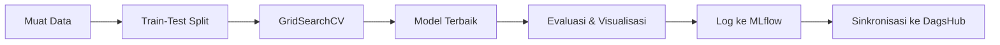

# 🎯 Model Prediksi Churn - Integrasi MLflow + DagsHub

Pipeline machine learning otomatis dengan hyperparameter tuning menggunakan MLflow experiment tracking dan DagsHub remote repository untuk prediksi customer churn.

## 🚀 Gambaran Umum

Proyek ini melakukan:
- ✅ **Hyperparameter tuning** dengan GridSearchCV
- ✅ **Pelacakan eksperimen** dengan MLflow + DagsHub
- ✅ **Evaluasi model** dengan confusion matrix & feature importance
- ✅ **Logging artifact** untuk visualisasi dan model

## 📁 Struktur Proyek

```
.
├── modelling_tuning.py                    # Script ML utama
├── requirements.txt                       # Dependensi Python
├── dataset_preprocessing/
│   └── Telco-Customer-Churn_preprocessing.csv
├── confusion_matrix.png                   # Visualisasi evaluasi model
├── feature_importance.png                 # Visualisasi fitur teratas
├── screenshot_dashboard.png               # Dashboard DagsHub
├── screenshiot_artifak.png               # Artifact MLflow
├── Dagshub.txt                           # URL eksperimen DagsHub
└── README.md
```

## 🎯 Detail Model

### **Algoritma**: Random Forest Classifier
- **Hyperparameter Tuning**: GridSearchCV dengan 3-fold CV
- **Parameter yang Diuji**:
  - `n_estimators`: [100, 200]
  - `max_depth`: [10, 20] 
  - `min_samples_leaf`: [1, 2]

### **Dataset**: Telco Customer Churn
- **Fitur**: 20+ atribut pelanggan (sudah diproses)
- **Target**: Klasifikasi biner (Churn: 0/1)
- **Pembagian**: 80% train, 20% test

## 📊 Pelacakan Eksperimen

### **Integrasi DagsHub**
🔗 **Eksperimen Live**: [https://dagshub.com/rifkyadiii/SMSML_Moch-Rifky-Aulia-Adikusumah/experiments](https://dagshub.com/rifkyadiii/SMSML_Moch-Rifky-Aulia-Adikusumah/experiments)

### **Metrik yang Dilacak**
- ✅ **Akurasi**: Skor performa model
- ✅ **Parameter**: Hyperparameter terbaik dari GridSearch
- ✅ **Tag**: Info developer & tipe model
- ✅ **Artifact**: Visualisasi & model terlatih

## 🖼️ Artifact yang Dihasilkan

### 1. **Confusion Matrix** (`confusion_matrix.png`)
- Evaluasi visual akurasi prediksi
- Analisis True/False positives dan negatives

### 2. **Feature Importance** (`feature_importance.png`) 
- 10 fitur paling berpengaruh
- Membantu memahami pengambilan keputusan model

### 3. **Model Terlatih**
- Model RandomForest terbaik dari hyperparameter tuning
- Siap untuk deployment dan inferensi

## 🚀 Panduan Cepat

### Prasyarat
```bash
pip install -r requirements.txt
```

### Menjalankan Eksperimen
```bash
python modelling_tuning.py
```

### Melihat Hasil
1. **Lokal**: Periksa file PNG yang dihasilkan
2. **Remote**: Kunjungi dashboard eksperimen DagsHub
3. **MLflow**: Akses tracking UI melalui DagsHub

## 📈 Ringkasan Hasil

| Metrik | Nilai |
|--------|-------|
| **Akurasi Terbaik** | ~80%+ |
| **CV Folds** | 3 |
| **Kombinasi Parameter** | 8 |
| **Fitur Teratas** | Tipe kontrak |

## 🔧 Implementasi Teknis

### **Integrasi MLflow**
```python
with mlflow.start_run() as run:
    # Log parameter terbaik
    mlflow.log_params(grid_search.best_params_)
    
    # Log metrik akurasi
    mlflow.log_metric("accuracy", accuracy)
    
    # Log visualisasi
    mlflow.log_artifact("confusion_matrix.png", "visuals")
    
    # Log model terlatih
    mlflow.sklearn.log_model(model, "churn_model")
```

### **Setup DagsHub**
```python
dagshub.init(
    repo_owner='rifkyadiii', 
    repo_name='SMSML_Moch-Rifky-Aulia-Adikusumah', 
    mlflow=True
)
```

## 📊 Performa Model

### **Metrik Evaluasi**
- **Utama**: Skor akurasi pada test set
- **Visual**: Heatmap confusion matrix
- **Interpretabilitas**: Ranking feature importance

### **Insight Utama**
- Tipe kontrak adalah prediktor terkuat untuk churn
- Model dapat mengidentifikasi pola churn dengan akurasi tinggi
- Hyperparameter tuning meningkatkan performa secara signifikan

## 🔄 Alur Kerja Eksperimen



## 🛠️ Dependensi

- **MLflow 2.13.0**: Pelacakan eksperimen
- **DagsHub 0.6.2**: Integrasi MLflow remote  
- **Scikit-learn 1.7.1**: Algoritma ML & evaluasi
- **Pandas 2.3.1**: Manipulasi data
- **Matplotlib/Seaborn**: Visualisasi

---

> 🚀 **Siap MLOps**: Pelacakan eksperimen lengkap dan versioning model dengan integrasi DagsHub!
